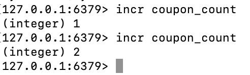
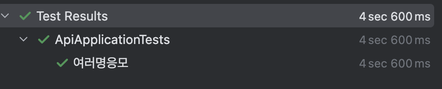
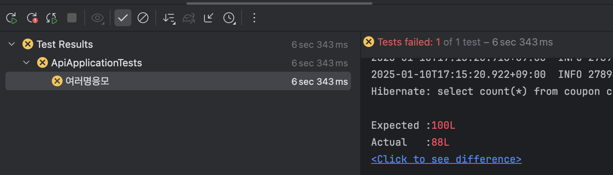

- 기대한 쿠폰 개수와 다름
- 이유: race condition 때문
  - 쿠폰 개수가 99개 일때, 스레스 1이 쿠폰을 생성하기 전에 스레드2가 쿠폰 개수를 조회하면서 스레드 2도 쿠폰을 생성하면서 발생한 문제. 

 

## race condition
 두 개 이상의 스레드가 공유자원에 접근하고 작업을 할 때 결과가 달라질 수 있는 문제.

### 1. 싱글스레드를 사용한다면?
=> 성능에 문제가 생긴다. 
- 10:01 1번 사용자 응모 
- 10:02 발급완료
  - 10:02 이후 2,3,4,...번 사용자 응모 가능해짐

### 2. 자바의 synchronized 를 사용한다면?
=> 서버가 여러대가 된다면 race condition 이 다시 발생한다.

### 3. mysql과 redis를 활용해 lock 을 구현하여 사용할 수 있다.
=> 성능에 좋지 않다. 쿠폰 발급만 lock을 걸고 싶은 건데, 발급된 쿠폰 개수를 가져오는 것 부터 lock 이 걸리기 때문이다.

### 4. redis의 incr 명령어를 사용한다.

redis incr 명령어: key에 대한 value를 1씩 증가시킨다.   
=> redis는 싱글 스레드로 동작하고, 이 명령어는 성능도 빠르다.

#### 발생할 수 있는 문제점 1   
redis에서 쿠폰 개수를 가져오고 100개미만이라면 rdb에 쿠폰을 발급하는 로직.   
=> 쿠폰 수가 많아질수록, 동시에 많은 요청이 일어나면 rdb에 부하가 생긴다.   
쿠폰발급 전용 db가 아니라면, 다른 api 호출에도 부하가 발생할 수 있다.

 

### 5. kafka를 사용한다.
=> 단점: 실제 발행시점이 조금 다를 수 있다.

#### kafka란?
분산 이벤트 스트리밍 플랫폼  
이벤트 스트리밍이란 소스에서 목적지까지 이벤트를 실시간으로 스트리밍 하는 것   

#### 테스트 실패한 이유 
실시간 처리가 아니기때문에 컨슈머가 다 쿠폰을 다 생성하기 전에 테스트 케이스가 끝날 수 있다.

### 한 유저당 하나만 지급되어야 한다.

#### 1. mysql db unique key 사용 
=> 다른 쿠폰들이 있을 수 있다.

#### 2. 범위로 Lock을 걸고 쿠폰 발급 여부를 판단하는 방법: if(발급됐다면) return 
=> api에서는 쿠폰 발급 여부만 판단하고 실제로 생성은 consumer에서 하고 있음. 그 사이 쿠폰이 발급된다면 중복이 발생할 수 있다.

#### 3. api에서 직접 쿠폰을 발급한다고 해도 
=> lock 범위가 너무 넓어져 성능 저하 이슈가 발생한다.

#### 4. redis의 set 자료구조를 사용해 제어한다.

